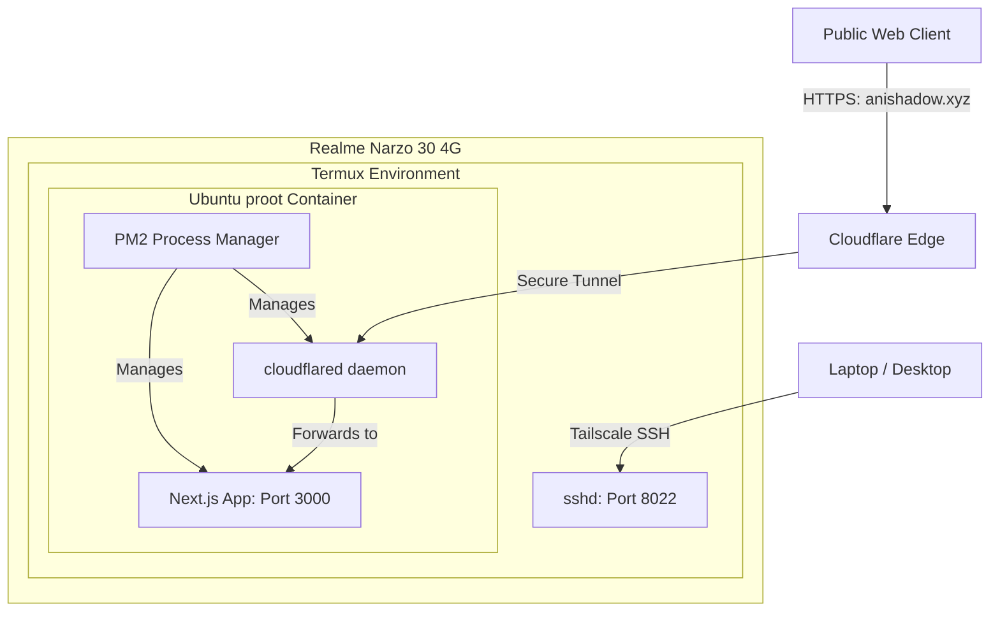

# Complete Phone VPS Setup & Deployment Guide

This document provides a comprehensive guide to setting up an Android phone as a personal VPS and deploying any project on it using Node.js, PM2, and Cloudflare Tunnels.

---

## System Architecture



---

## Phase 1: Android & Termux Base Setup

### 1. Install Termux
Install Termux using the latest APK from the [F-Droid repository](https://f-droid.org/packages/com.termux/) or the GitHub releases page. Do not use the Play Store version, as it is deprecated.

### 2. Configure OpenSSH
Start and configure the SSH server to manage the phone from your laptop:
```bash
pkg update && pkg upgrade -y
pkg install openssh -y
passwd                             # Set a password for ssh login
sshd                               # Start the SSH daemon (default port is 8022)
```

Find the phone's local IP:
```bash
ip addr show wlan0
```

### 3. Connect from Laptop
Configure your SSH config file on your laptop for quick access.

* **On Windows:** `C:\Users\<username>\.ssh\config`
* **On Linux/macOS:** `~/.ssh/config`

Add the following configuration:
```text
Host phone
  HostName <PHONE_IP_OR_TAILSCALE_IP>
  User u0_a203                     # Run 'whoami' in Termux to find your user ID
  Port 8022
  IdentityFile ~/.ssh/id_ed25519   # (Optional) If using SSH keys
```

Now connect easily using:
```bash
ssh phone
```

---

## Phase 2: Ubuntu Container Setup (proot-distro)

To run a full Linux environment with support for packages that expect a standard Linux layout, install Ubuntu via `proot-distro`:

```bash
pkg install proot-distro -y
proot-distro install ubuntu
proot-distro login ubuntu
```

### 1. Update and Install Core Packages
Inside the Ubuntu shell (`root@localhost:~#`), run:
```bash
apt update && apt upgrade -y
apt install -y git curl wget nano unzip htop build-essential
```

### 2. Install Node.js, PNPM, and PM2
```bash
# Install Node.js
curl -fsSL https://deb.nodesource.com/setup_20.x | bash -
apt install -y nodejs

# Install PNPM globally
npm install -g pnpm

# Install PM2 globally
npm install -g pm2
```

### 3. Shell Optimizations
To hide the Termux welcome screen and automatically land inside the Ubuntu container when you SSH in, run these commands **inside Termux** (exit the Ubuntu shell first):

```bash
# Hide the MOTD welcome message
touch ~/.hushlogin

# Add auto-login to ~/.bashrc
nano ~/.bashrc
```

Add the following block:
```bash
if [ -z "$SSH_AUTO_UBUNTU" ]; then
    export SSH_AUTO_UBUNTU=1
    exec proot-distro login ubuntu
fi
```

---

## Phase 3: Tailscale Networking

To access your phone VPS from college, work, or mobile networks without port forwarding, use Tailscale:

1. Install the Tailscale app on your Android phone and log in.
2. Install Tailscale on your laptop and log in.
3. Use the phone's Tailscale IP (e.g., `100.x.x.x`) as the `HostName` in your `~/.ssh/config` file to connect from anywhere in the world.

---

## Phase 4: Cloudflare Tunnel (Expose to Public Domain)

Cloudflare Tunnels route traffic from your custom domain (`anishadow.xyz`) directly to local ports on your phone VPS securely, bypassing CGNAT and providing free SSL certificates.

### 1. Install `cloudflared` (ARM64)
Since the phone uses an ARM64 processor, run this inside the **Ubuntu** container:
```bash
curl -L --output cloudflared.deb https://github.com/cloudflare/cloudflared/releases/latest/download/cloudflared-linux-arm64.deb
dpkg -i cloudflared.deb
rm cloudflared.deb
```

### 2. Authenticate with Cloudflare
```bash
cloudflared tunnel login
```
Copy the link shown, open it in your browser, select your domain, and authorize it.

### 3. Create the Tunnel
```bash
cloudflared tunnel create anishadow-tunnel
```
*Note down the **Tunnel UUID** generated.*

### 4. Create Configuration
```bash
mkdir -p ~/.cloudflared
nano ~/.cloudflared/config.yml
```
Add the following configuration:
```yaml
tunnel: <TUNNEL_UUID>
credentials-file: /root/.cloudflared/<TUNNEL_UUID>.json

ingress:
  - hostname: anishadow.xyz
    service: http://localhost:3000
  - hostname: www.anishadow.xyz
    service: http://localhost:3000
  - hostname: api.anishadow.xyz
    service: http://localhost:3000
  - service: http_status:404
```

### 5. Route DNS
Remove any conflicting A or CNAME records in your Cloudflare DNS settings for the domains, then run:
```bash
cloudflared tunnel route dns anishadow-tunnel anishadow.xyz
cloudflared tunnel route dns anishadow-tunnel www.anishadow.xyz
cloudflared tunnel route dns anishadow-tunnel api.anishadow.xyz
```

### 6. Manage Tunnel via PM2
Keep the tunnel running 24/7:
```bash
pm2 start cloudflared --name "cf-tunnel" -- tunnel run anishadow-tunnel
pm2 save
```

---

## Phase 5: Standardizing Project Deployment

Use this template to deploy **any** Node.js project onto your Phone VPS.

### 1. Create `ecosystem.config.cjs`
Place this in the root of the project to tell PM2 how to run it.
```javascript
module.exports = {
  apps: [
    {
      name: "your-app-name",
      script: "dist-server/index.mjs",
      instances: 1,
      exec_mode: "fork",  // 'fork' is recommended over 'cluster' in proot/Termux
      watch: false,
      max_memory_restart: "512M",
      env: {
        NODE_ENV: "production",
        PORT: 3000,       // Custom port for this app
      },
    },
    {
      // Optional Scrapling sidecar (Python) — remove if you don't use it.
      // The API keeps working with native fetch when this app is down.
      name: "your-app-name-sidecar",
      script: "scripts/run-sidecar.mjs",
      instances: 1,
      exec_mode: "fork",
      watch: false,
      max_memory_restart: "400M",
      max_restarts: 5,
      env: { SCRAPLING_PORT: "3002" },
    },
  ],
};
```
*Use the `.cjs` extension when `package.json` has `"type": "module"` — Node treats `.js` files as ESM then, and `module.exports` would fail.*

**Optional anti-bot sidecar setup (Python/Scrapling):**
```bash
pkg install python        # Termux — or use proot-distro Ubuntu's python3
pip install "scrapling[fetchers]"
python -m patchright install chromium   # stealth browser (~150 MB; skip on tight storage)
```
Without Python the sidecar app shows as errored in PM2 — harmless, the app
falls back to native fetch automatically (one warning in `pm2 logs`).

### 2. Create `deploy.sh`
Place this script in the root of the project to automate the deploy/update process.
```bash
#!/bin/bash
set -e

APP_NAME="your-app-name"

echo "=== Deploying $APP_NAME ==="
git pull

echo "--> Installing dependencies..."
pnpm install

echo "--> Building project..."
pnpm build

echo "--> Restarting process..."
if pm2 show $APP_NAME > /dev/null 2>&1; then
  pm2 restart $APP_NAME
else
  pm2 start ecosystem.config.cjs
fi

pm2 save
echo "=== Deployment Successful! ==="
```
*Make it executable:* `chmod +x deploy.sh`

---

## Phase 6: Troubleshooting & Workarounds

### 1. Server Can't Find `dist/`
The production server (`server/index.ts`) serves the built frontend from `./dist` **relative to the process working directory**. If PM2 starts it from anywhere else, pages will 404.
* **Fix:** Always launch PM2 from the project root (`pm2 start ecosystem.config.cjs` inside the repo), and don't `cd` away before starting.

### 2. PNPM Ignored Build Scripts
Modern PNPM security features ignore build scripts (`postinstall`, etc.) by default, which can break dependencies like `sharp` or `canvas` on compilation.
* **Fix:** Add them explicitly to the `allowBuilds` list in `pnpm-workspace.yaml` in your root:
  ```yaml
  allowBuilds:
    sharp: true
    unrs-resolver: true

  # Legacy compatibility for older PNPM versions:
  onlyBuiltDependencies:
    - sharp
    - unrs-resolver
  ```

### 3. DNS Cache / Cloudflare Propagation Delay
If you configure your domain but still see Vercel's `404: DEPLOYMENT_NOT_FOUND` error:
* **Reason:** Global nameservers take time to update (30m to 24h).
* **Fix:** Flush your local DNS cache on your Windows laptop:
  ```cmd
  ipconfig /flushdns
  ```
  Check the Cloudflare dashboard homepage to ensure the status of your domain is **"Active"**.
